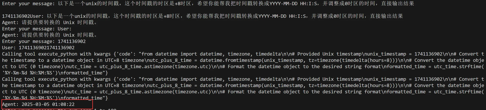

# E2B_MCP
English | [中文](./README_zh.md)

Support connecting E2B via MCP with a custom server and client, without the need for tools like the Claude app or Cursor.

## Run Server
First, create a `.env` file and fill in the following variables. `E2B_API_KEY` needs to be obtained from the E2B official website, and `api_key` is your LLM's API key:
```
E2B_API_KEY= ""
api_key=""
```

Then start the server:
```bash
python ./e2b_mcp_server.py
```

Open a new terminal window and run the client:
```bash
python ./e2b_mcp_llamaindex_client.py
```

The result looks like this:


