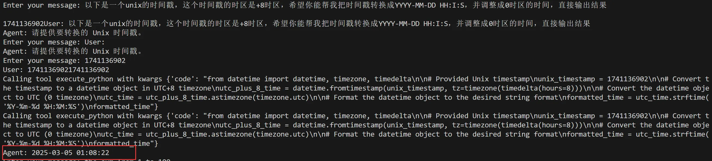

# E2B_MCP
中文 | [English](./README.md)

支持通过 MCP 协议连接 E2B，包含自定义的服务端和客户端，无需依赖如 Claude 应用、Cursor 等工具。

## 运行服务端
首先创建 `.env` 文件，并填写以下变量。其中 `E2B_API_KEY` 需要前往 E2B 官网申请，`api_key` 是 LLM 的 API Key：
```
E2B_API_KEY= ""
api_key=""
```

然后启动服务端：
```bash
python ./e2b_mcp_server.py
```

打开一个新的终端窗口，运行客户端：
```bash
python ./e2b_mcp_llamaindex_client.py
```

效果如下：


